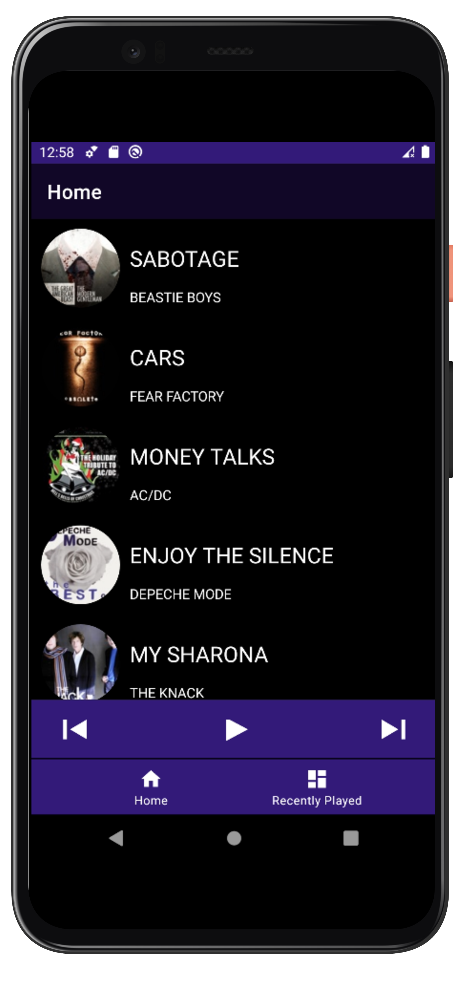

# Music Plate App

A demo project to share my learnings

This app demonstrate the use of mvvm architecure with Hilt depenedency injection and Room Database
## Features

- [x] kotlin AndroidX
- [x] MVVM architecture
- [x] Hilt dependency Injection
- [x] Room Database 
- [x] LiveData
- [x] Mockito Testing 

## Description
- Music player application has two Fragments
- Home screen show currently playing Songs list
- Recent Screen shows Recenlty played songs list
- Bottom navigation is used to swtich between these 2 screens

## Hilt Dependency
Why i used Hilt over Dagger
-Hilt is extension to the dagger library
-This library removes lot of boilerplate code that we need to write
-No worries to declare Components.those who have worked on dagger would know how components creation is filthy.
-Hilt automatically generates Components for every module

## Room
adding room library in mvvm architecture is very easy.
no need to write lot of of code like sqlite
annotations like @insert,@update, @delete, @select would do job of inserting ,updating,deleting ,selection 
entity can be easil mapped to model and vise versa

